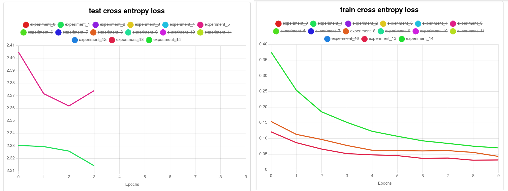
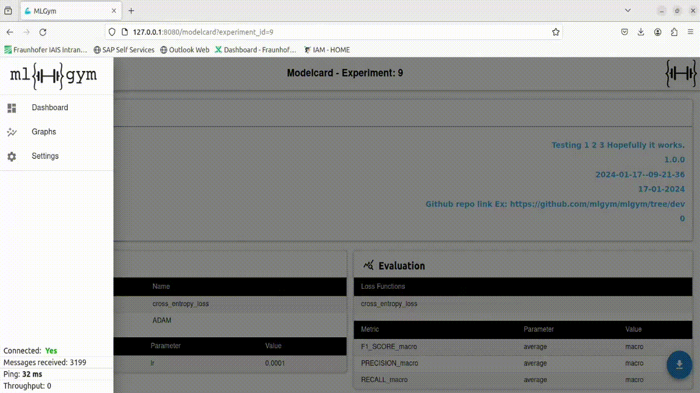

## MLBoard

In the GIF images below, we present a detailed walkthrough of an example run using the above provided tutorial of [`grid_search_example`](https://github.com/mlgym/mlgym/blob/project-for-UI-documentation/README.md#usage). Follow the sequential execution commands to seamlessly initiate and monitor the experiment.

1. **WebSocket Connection:** Initiate the WebSocket connection.
```sh
ml_board_ws_endpoint --host 127.0.0.1 --port 5002 --event_storage_path event_storage --cors_allowed_origins http://127.0.0.1:8080 http://127.0.0.1:5002
```

2. **Restful APIs:** Start the Restful APIs.
```sh
ml_board_rest_endpoint --port 5001 --event_storage_path event_storage
```

3. **Pipeline Execution:** Run the Python file to execute the pipeline.
```sh
cd mlgym/example/grid_search_example

python run.py  --config_path run_config.yml
```

4. **Frontend Visualization:** Launch the frontend (mlboard) to visualize metrics and loss for different experiments.
```sh
ml_board --ml_board_host 127.0.0.1 --ml_board_port 8080 --rest_endpoint http://127.0.0.1:5001 --ws_endpoint http://127.0.0.1:5002 --run_id YOUR_RUN_ID
```

The above script returns the parameterized URL pointing to the respective experiment run:
```
====> ACCESS MLBOARD VIA http://127.0.0.1:8080?rest_endpoint=http://127.0.0.1:5001&ws_endpoint=http://127.0.0.1:5002&run_id=run_id=YOUR_RUN_ID
```

<div align="center">

</div>

### Monitoring and Analysis

After executing the example run, proceed to monitor and analyze the experiment using the `ml_board`. First execute the ml_board [Frontend Visualization](ML_BOARD.md#mlboard) command with the example run ID, and copy the provided URL. Paste the URL in your browser to access the frontend.

1. **Configuring Frontend:** Confirm the configurations in the auto-populated popup or customize them as needed. Enter the desired run ID for monitoring.
2. **Popup Confirmation:** Confirm the values in the popup. Upon successful confirmation, a socket connection is established, listening to log messages from the specified run ID.
3. **Live Feed:** On successful socket connection, you automatically transition to the analysis board, where you receive live updates on metric and loss developments via line charts.

<div align="center">

</div>

### Experiment Analysis

Navigate to a specific experiment ID to analyze its configurations and observe live developments of metrics, loss, batches, and epochs. You can select and download a specific checkpoint and other picked files for further examination or external reference. Here, you can also access information regarding the environment and hardware settings under which the experiment was executed.

This comprehensive experiment analysis functionality within `ml_board` empowers users to extract valuable insights, inspect detailed configurations, and download pertinent files for a thorough examination and reproducibility of the experiment's outcomes.

<div align="center">

</div>

### Experiment Filtering

Efficiently compare different experiments globally by utilizing the filtering options available in the analysis board and dashboard. Here's a breakdown of the filter options in dashboard:

- **Hover Button Options:**
  - **Filter by Text:** Use this option to filter experiment entries based on specific text criteria.
  - **Filter by Headers:** Use this option to filter experiments using column headers for a more specific column category or metric analysis.

- **Table Header Filtering**
    - Within the table headers, you have the flexibility to filter experiment data based on column values. This granular approach enables users to refine their analysis and focus on specific aspects of the experiments, facilitating a deeper understanding and comparision of the results.

<div align="center">

</div>

## Training Analysis

Over the course of the training, the line charts are populated with the respective scores for each epoch. The legend in the charts refers to the experiment ids. From an analysis point of view, as per below image, we see that experiments 1 and 5 fail to converge and are stopped after four epochs due to the early stopping criterion specified within the configuration file. In contrast, experiments 8, 13 and 14 learn the task, illustrating the significance of learning rate choice anecdotically.

<div align="center">

</div>

## Model Card
`Will be added soon!!!`
<!-- <div align="center">

</div> -->

## Settings Menu

Explore and customize configurations effortlessly through the settings menu on the `ml_board` frontend. 

Explore the settings menu on the frontend to view and modify configurations, including the configured run ID, socket connection endpoint, and Rest API endpoint. 

### Grid Search Configs and Run Configs:

**Grid Search Configs:** Review the configurations employed in the grid search, aiding in understanding the experiment's setup directly in the frontend.

**Run Configs for Specific Run-ID:** Access the configurations specific to the provided run ID.

You can easily download both Grid Search Configurations and Run Configurations for external reference or documentation purposes.

### Configuration Modification:

- **Change Settings:** Modify configurations by entering new values and clicking the save button, ensuring quick adaptability to the new requirements.
- **Clear Settings:** Remove or clear existing configurations by clicking the clear button. This action drops current connections and clears all associated messages and logs.

The settings menu in `ml_board` serves as a centralized hub for configuration management, facilitating a quick, smooth and organized user experience in exploring, modifying, and downloading experiment settings.

<div align="center">

</div>

