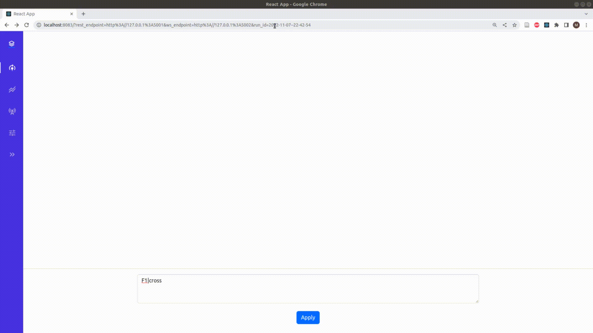
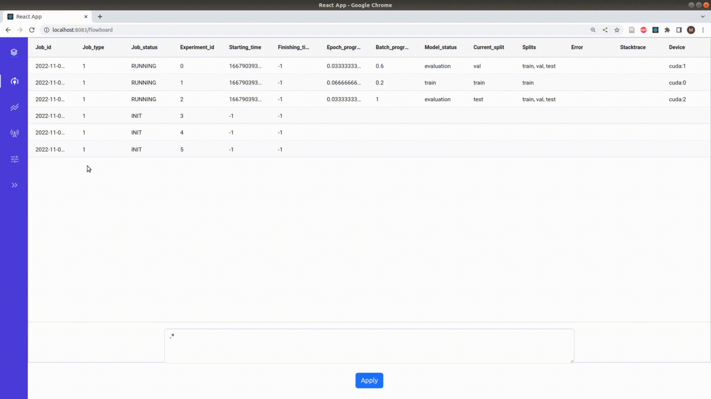

<div align="center">

</div>

---

a feature-rich deep learning framework providing full reproducibility of experiments.

[](https://circleci.com/gh/mlgym/mlgym/tree/master)

Reproducibility is a recurring issue in deep learning (research) with models often being implemented in Jupyter notebooks or entire training and evaluation pipelines implemented from scratch with every new project.
The lack of standardization and repetitive boilerplate code of experimental setups impede reproducibility.

MLgym aims to increase reproducibility by separating the experimental setup from the code and providing the entire infrastructure for e.g., model training, model evaluation, experiment logging, checkpointing and experiment analysis.

Specifically, MLgym provides an extensible set of machine learning components (e.g., trainer, evaluator, loss functions, etc.). The framework instantiates these components dynamically as specified and parameterized within a configuration file (see here, for an exemplary configuration) describing the entire experiment setup (i.e., training and evaluation pipeline). The separation of experimental setup and code maximizes the replicability and interpretability of ML experiments. The machine learning components cut down the implementational efforts significantly and lets your focus solely on your ideas.

Additionally, MLgym provides the following key features:

- Component registry to register custom components and their dependencies.

- Warm starts allowing to resume training after crash

- Customizable checkpointing strategies

- MLboard webservice for experiment tracking / analysis (live and offline) by subscribing to the websocket logging environment

- Large scale, multi GPU training supporting grid search, nested cross validation and cross validation

- Distributed logging via websockets and event sourcing, allowing location-independent logging and full replicability

- Definition of training and evaluation pipeline in a configuration file, achieving separation of experiment setup and code.

**Please note, that at the moment this code should be treated as experimental and is not production ready.**

## Install

there are two options to install MLgym, the easiest way is to install the framework from the pip repository:

```bash
pip install mlgym
```

For the latest version, one can directly install it from source by `cd` into the root folder and then running

```bash
pip install src/
```

## Usage

We provide an easy-to-use example that lets you run a MLgym [experiment setup](https://github.com/le1nux/mlgym/tree/master/example/grid_search_example).

Before running the experiments we need to setup the MLboard logging environment, i.e., the websocket service and the RESTful webservice. MLgym logs the training/evaluation progress and evaluation results via the websocket API, allowing the MLboard frontend to receive live updates. The RESTful webservice provides endpoints to receive checkpoints and experiment setups. For a full specification of both APIs see [here](https://github.com/le1nux/mlgym/tree/master/src/ml_board/README.md).

We start the websocket service and the RESTful webservice on ports 5001 and 5002, respectively. Feel free to choose different ports if desired.
Similarly, we specify the folder `event_storage` as the local event storage folder. Note, to access the websocket service from a different port, we need to specify the [CORS](https://developer.mozilla.org/en-US/docs/Web/HTTP/CORS) allowed origins. In thise example, we only use the websocket service locally from 127.0.0.1:8080 via the MLboard frontend.

```sh
ml_board_ws_endpoint --host 127.0.0.1 --port 5002 --event_storage_path event_storage --cors_allowed_origins http://127.0.0.1:8080

ml_board_rest_endpoint --port 5001 --event_storage_path event_storage

```

Next, we run the experiment setup. We `cd` into the example folder and run `run.py` with the respective config whose path is passed via the parameter `config_path`.
In the example folder you will see that there is a `run_config.yml` file, this is responsible for providing all necessary details for mlGym to run.

This is how the run_config.yml looks like:

```
run_configuration:
  type: train # train, warmstart
  config:
    num_epochs: 10 # Number of epochs
    gs_config_path: ./gs_config.yml

environment:
  type: multiprocessing # multiprocessing,  main_process, accelerate
  config:
    process_count: 1 # Max. number of processes running at a time.
    computation_device_ids: null # Indices of GPUs to distribute the GS over

logging:
  websocket_logging_servers: # List of websocket logging servers, e.g., http://127.0.0.1:9090 http://127.0.0.1:8080
    - http://127.0.0.1:5002
  gs_rest_api_endpoint: http://127.0.0.1:5001 # Endpoint for the grid search API, e.g., http://127.0.0.1:8080

```

The parameter `process_count` specifies the number of experiments that we run in parallel. `num_epochs` limits the maximum number of epochs to train a model. If the model performance does not improve substantially over time, the checkpointing strategy defined in `gs_config.yml` will stop training prematurely.

```sh

cd mlgym/example/grid_search_example

python run.py --config_path run_config.yml
```

To visualize the live updates, we run the [MLboard](https://github.com/mlgym/mlgym#mlboard) frontend. We specify the server host and port that delivers the frontend and the endpoints of the REST webservice and the websocket service. The parameter `run_id` refers to the experiment run that we want to analyze and differs in your case. Each experiment runs is stored in separate folders within the `event_storage` path. The folder names refer to the respective experiment run ids.

```sh
ml_board --ml_board_host 127.0.0.1 --ml_board_port 8080 --rest_endpoint http://127.0.0.1:5001 --ws_endpoint http://127.0.0.1:5002 --run_id 2022-11-06--17-59-10
```

The script returns the parameterized URL pointing to the respective experiment run:

```
====> ACCESS MLBOARD VIA http://127.0.0.1:8080?rest_endpoint=http%3A//127.0.0.1%3A5001&ws_endpoint=http%3A//127.0.0.1%3A5002&run_id=2022-11-06--17-59-10

```

Note, that the Flask webservice delivers the compiled react files statically, which is why any changes to the frontend code will not be automatically reflected. As a solution, you can start the MLboard react app directly via yarn and call the URL with the respective URL search params in the browser

```sh
cd mlgym/src/ml_board/frontend/dashboard

yarn start
```

To this day, the MLboard frontend is still under development and not all features have been implemented, yet. For a brief overview of its current state, checkout the [MLboard section](https://github.com/mlgym/mlgym#mlboard). Generally, it is possible analyze the log files directly in the event storage. All messages are logged as specified within the [websocket API](https://github.com/le1nux/mlgym/tree/master/src/ml_board/README.md)

To see the messages live `cd` into the event storage directory and `tail` the `event_storage.log` file.

```sh
cd event_storage/2022-11-06--17-59-10/
tail -f event_storage.log
```

## MLboard

Since MLboard frontend is still under heavy development, we would like to give you an overview of its current state and a sneak peek about what is going to come in the foreseeable future.

In the GIF image below, we showcase the experiment run of the getting started tutorial above, which is a sweep over different learning rates. We replaced the experiment run id from a previous run with the current one in the browser and clicked on the throughput board menu button to check if we are successfully connected and receive messages. We then headed over to the analysis board by clicking on the analysis board menu button, providing us with a live feed of the metric and loss developments via the line charts. In the filter form at the buttom, we specified a regex expression filtering for F1 score metric and cross-entropy loss, to limit the scope to the most relevant information.

Over the course of the training, the line charts are populated with the respective scores for each epoch. The legend in the charts refers to the experiment ids. From an analysis point of view, we see that experiments 0, 1, and 2 fail to converge and are stopped after three epochs due to the early stopping criterion specified within the configuration file. In contrast, experiments 3, 4 and 5 learn the, illustrating the significance of learning rate choice anecdotically.

<div align="center">

</div>

The technical progress of the experiment run can be tracked from the flowboard, as presented below. The flowboard summarizes the state of all experiments within a table including the job status (init, running, done), starting and finishing time. The overall progress is tracked via column `epoch_progress`. Within an epoch we different between two model states, namely training and evaluating, as tracked by column `model_status` and the current split and its progress are captures by `current_split` and `batch_progress`, respectively. The devicde column indicates the computation device that the model is sitting on.

<div align="center">

</div>

**Future work**

Currently, we collected a lot of exciting ideas forthe frontend in our backlog.

Analogously to the idea of experiment reproducibility, we think about aiming in the direction of analysis reproducibility. To this end, we consider defining the entire analysis setup within the text input. The analysis setup could be exported or version controlled and shared with fellow researchers.

Additionally, we consider the following features/ideas for the flowbord page:

- Right now, flowboard only shows the epoch and batch progress. Additional information such as the experiment's hyperparameter combination and the current metric/loss scores would be benificial.
- Clicking on one of the experiments should visualize the experiment's entire training and evaluation pipeline configuration (e.g., pop up window)
- A download/export functionality for the trained model
- Higher level functionality for model selection, e.g., by defining the selection strategy within the text input.

Similarly, for the analysis board we consider:

- Visualizing the influence of hyperparamter choice on the metrics and losses
- Model selection routines

Implementing these features will require some time. On the plus side, we already collect and store all the necessary information on the client-side, ... so stay tuned! ;-)

## Copyright

Copyright (c) 2023

For license see: https://github.com/mlgym/mlgym/blob/master/LICENSE
