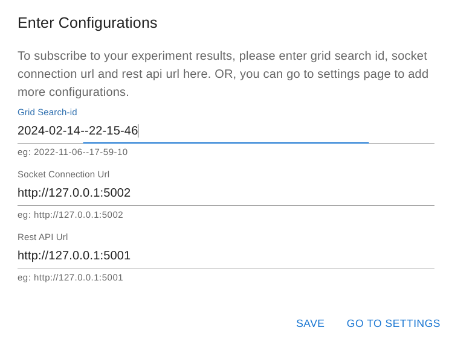
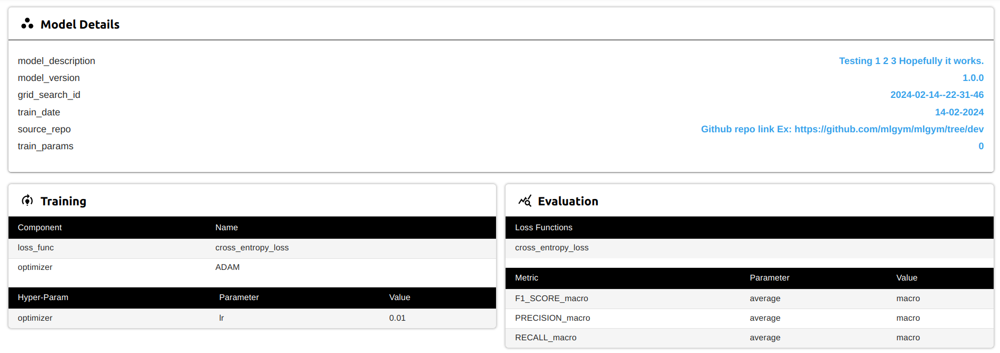
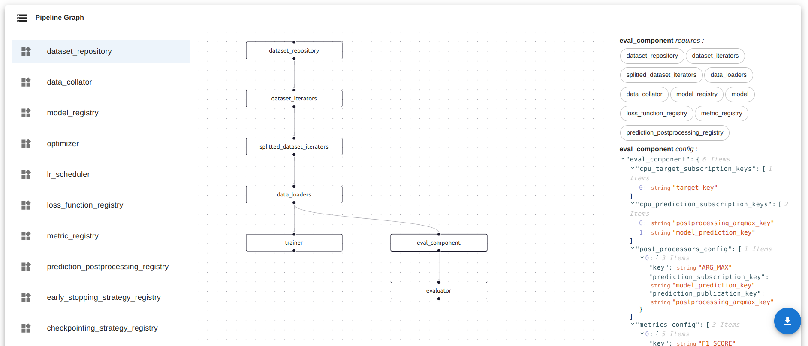

<div align="center">

</div>

---

A feature-rich deep learning framework providing full reproducibility of experiments.

[](https://circleci.com/gh/mlgym/mlgym/tree/master)

Reproducibility is a recurring issue in deep learning (research) with models often being implemented in Jupyter notebooks or entire training and evaluation pipelines implemented from scratch with every new project.
The lack of standardization and repetitive boilerplate code of experimental setups impede reproducibility.

MLgym aims to increase reproducibility by separating the experimental setup from the code and providing the entire infrastructure for e.g., model training, model evaluation, experiment logging, checkpointing and experiment analysis.

Specifically, MLgym provides an extensible set of machine learning components (e.g., trainer, evaluator, loss functions, etc.). The framework instantiates these components dynamically as specified and parameterized within a configuration file (see here, for an exemplary configuration) describing the entire experiment setup (i.e., training and evaluation pipeline). The separation of experimental setup and code maximizes the replicability and interpretability of ML experiments. The machine learning components cut down the implementational efforts significantly and lets your focus solely on your ideas.

Additionally, MLgym provides the following key features:

- Component registry to register custom components and their dependencies.

- Warm starts allowing to resume training after crash

- Customizable checkpointing strategies

- MLboard webservice for experiment tracking / analysis (live and offline) by subscribing to the websocket logging environment

- Large scale, multi GPU training supporting grid search, nested cross validation and cross validation

- Distributed logging via websockets and event sourcing, allowing location-independent logging and full replicability

- Definition of training and evaluation pipeline in a configuration file, achieving separation of experiment setup and code.

**Please note, that at the moment this code should be treated as experimental and is not production ready.**

## Install 🚀

There are two options to install MLgym, the easiest way is to install the framework from the pip repository:

```bash
pip install mlgym
```

For the latest version, one can directly install it from source by `cd` into the root folder and then running

```bash
pip install src/
```

## Experience MLGym in Action 🎬💪
Experience it firsthand by exploring our live demo. Interact with the metric graphs, model-card, experiment with different filters, and see the capabilities of our framework in action. Discover how MLGym can help in maintaining and monitoring your experiments.
### [👉 Checkout Our Live Demo 👈](https://mlgym.github.io/mlgym/build/)


## Usage

We provide an easy-to-use and a detailed walkthrough of an example that lets you run a MLgym [experiment setup](https://github.com/le1nux/mlgym/tree/master/example/grid_search_example). Follow the execution commands to seamlessly initiate and monitor the experiment.

For running the experiments we first need to setup the MLboard logging environment, i.e., the websocket service and the RESTful webservice. 

1. **WebSocket Connection:** MLgym logs the training/evaluation progress and evaluation results via the websocket API, allowing the MLboard frontend to receive live updates. Initiate the WebSocket connection as follows:

```sh
ml_board_ws_endpoint --host 127.0.0.1 --port 5002 --event_storage_path event_storage --cors_allowed_origins http://127.0.0.1:8080 http://127.0.0.1:5002
```

2. **Restful APIs:** The RESTful webservice provides endpoints to receive checkpoints and experiment setups. For a full specification of both (WebSocket and Restful) APIs see [here](https://github.com/le1nux/mlgym/tree/master/src/ml_board/README.md). You can start the Restful APIs as follows:
```sh
ml_board_rest_endpoint --port 5001 --event_storage_path event_storage
```

We start the websocket service and the RESTful webservice on ports 5001 and 5002, respectively. Feel free to choose different ports if desired.
Similarly, we specify the folder `event_storage` as the local event storage folder. Note, to access the websocket service from a different port, we need to specify the [CORS](https://developer.mozilla.org/en-US/docs/Web/HTTP/CORS) allowed origins. In thise example, we only use the websocket service locally from 127.0.0.1:8080 via the MLboard frontend.

3. **Pipeline Execution:** Next, we run the experiment setup. We `cd` into the example folder and run `run.py` with the respective run config whose path is passed via the parameter `config_path`.

```sh
cd mlgym/example/grid_search_example

python run.py  --config_path run_config.yml
```

The `run_config.yml` file contains all the parameters which is required for the MLGym to configure it self to run.

A preview of the yml file is given bellow: 
```yaml
run_configuration:
  type: train # train, warmstart
  config:
    num_epochs: 50 # Number of epochs
    num_batches_per_epoch: 100
    gs_config_path: ./gs_config.yml

environment:
  type: multiprocessing # multiprocessing,  main_process, accelerate
  config:
    process_count: 3 # Max. number of processes running at a time.
    computation_device_ids: [0] # Indices of GPUs to distribute the GS over

logging:
  websocket_logging_servers: # List of websocket logging servers, e.g., http://127.0.0.1:9090 http://127.0.0.1:8080
    - http://127.0.0.1:5002
  gs_rest_api_endpoint: http://127.0.0.1:5001 # Endpoint for the grid search API, e.g., http://127.0.0.1:8080
```
<details>
  <summary>Click here to know more about this yml file</summary>

  ## About the yml file

  Let us get into the header `run_configuration`, the parameter `type` tells the mlGym what type of Job is to be executed. `train` for starting fresh training of a model, `warmstart` for resuming training from a specific epoch. `num_epochs` limits the maximum number of epochs to train a model, `num_batches_per_epoch` limits the maximum number of batches in an epoch to train a model and `gs_config_path` gives the path to the grid search config file.

  In the header `environment`, the parameter type says if the training is to be done using only GPU (`accelerate`), CPU (`main_process`) or using both (`multiprocessing`). `process_count` specifies the number of experiments that we run in parallel and `computation_device_ids` indicates the indices of GPUs to distribute the GS over.

  The header `logging` contains the parameters to be used to set up the logging adapter in MlGym. The parameter `websocket_logging_servers` indicates the server address of the websocket server and `gs_rest_api_endpoint` indicates the server address of the restful API to be used for REST HTTP communications in MlGym.

  If the model performance does not improve substantially over time, the checkpointing strategy defined in `gs_config.yml` will stop training prematurely.

</details>

4. **Frontend Visualization:** To visualize the live updates, we run the [MLboard](https://github.com/mlgym/src/ml_board) frontend. We specify the server host and port that delivers the frontend and the endpoints of the REST webservice and the websocket service. The parameter `run_id` refers to the experiment run that we want to analyze and differs in your case. Each experiment runs is stored in separate folders within the `event_storage` path. The folder names refer to the respective experiment run ids.
```sh
ml_board --ml_board_host 127.0.0.1 --ml_board_port 8080 --rest_endpoint http://127.0.0.1:5001 --ws_endpoint http://127.0.0.1:5002 --run_id YOUR_RUN_ID
```

The above script returns the parameterized URL pointing to the respective experiment run:
```
====> ACCESS MLBOARD VIA http://127.0.0.1:8080?rest_endpoint=http://127.0.0.1:5001&ws_endpoint=http://127.0.0.1:5002&run_id=run_id=YOUR_RUN_ID
```

Note, that the Flask webservice delivers the compiled react files statically, which is why any changes to the frontend code will not be automatically reflected. As a solution, you can start the MLboard react app directly via yarn or npm and call the URL with the respective URL search params in the browser
```sh
cd mlgym/src/ml_board/frontend/dashboard

npm install 

npm start
```

To see the messages live `cd` into the event storage directory and `tail` the `event_storage.log` file.

```sh
cd event_storage/YOUR_RUN_ID/
tail -f event_storage.log
```

The following GIF showcases the development of experiments over time.
<div align="center">

</div>

### 📈 Monitoring and Analysis 📉

After executing the example run, proceed to monitor and analyze the experiment using the `ml_board`. First execute the `ml_board` command [Frontend Visualization : Step 4](#usage) with the example run ID, and copy the provided URL. Paste the URL in your browser to access the frontend.

1. **Configuring Frontend:** Confirm the configurations in the auto-populated popup or customize them as needed. Enter the desired run ID for monitoring.
2. **Popup Confirmation:** Confirm the values in the popup. Upon successful confirmation, a socket connection is established, listening to log messages from the specified run ID.
3. **Live Feed:** On successful socket connection, you automatically transition to the analysis board, where you receive live updates on metric and loss developments via line charts.

<!-- Change this. Show popup confirmation & live feed in GIF -->
<!-- <div align="center">

</div> -->

### Experiment Analysis 🔎

Navigate to a specific experiment ID to analyze its configurations and observe live developments of metrics, loss, batches, and epochs. You can select and download a specific checkpoint and other picked files for further examination or external reference. Here, you can also access information regarding the environment and hardware settings under which the experiment was executed.

This comprehensive experiment analysis functionality within `ml_board` empowers users to extract valuable insights, inspect detailed configurations, and download pertinent files for a thorough examination and reproducibility of the experiment's outcomes.


<div style="display: flex; flex-wrap: wrap; justify-content: center;">
  
  
  
  
  
  
</div>

### Experiment Filtering ⚡

Efficiently compare different experiments globally by utilizing the filtering options available in the analysis board and dashboard. Here's a breakdown of the filter options in dashboard:

- **Hover Button Options:**
  - **Filter by Text:** Use this option to filter experiment entries based on specific text criteria.
  - **Filter by Headers:** Use this option to filter experiments using column headers for a more specific column category or metric analysis.

- **Table Header Filtering**
    - Within the table headers, you have the flexibility to filter experiment data based on column values. This granular approach enables users to refine their analysis and focus on specific aspects of the experiments, facilitating a deeper understanding and comparision of the results.

<!-- <div align="center" style="display: flex; flex-direction: row; align-items: center; justify-content: center;">
  
</div> -->
<br/>
<div align="center">
  <div style="display: flex; flex-direction: row; align-items: center; justify-content: center;">
    
    
</div>
<br/>

</div>

## 📈 Training Analysis 📉

Over the course of the training, the line charts are populated with the respective scores for each epoch. The legend in the charts refers to the experiment ids. From an analysis point of view, as per below image, we see that experiments 1 and 5 fail to converge and are stopped after four epochs due to the early stopping criterion specified within the configuration file. In contrast, experiments 8, 13 and 14 learn the task, illustrating the significance of learning rate choice anecdotically.

<div align="center">

</div>

## Model Card 📃

Model cards are documents that provide essential information about the model training, evaluation, performance & the utilized environment. They play a vital role in understanding experiments and ensuring reproducibility. 

The different sections of a typical Model Card shown in MLGym are as follows:
<div align="center">
  
</div>
   
1. **Model Details**: Provides insights into the specifics of the trained model for a particular experiment, including version, parameters, experiment date, and GitHub project source.

2. **Training Details**: Provides details about the training process, encompassing optimizer, loss function, learning rate, and other such hyper parameters.

3. **Evaluation Details**: Explains how model performance was assessed, including loss function used, metrics measured, and any validation strategies.

<div align="center">
  
</div>

4. **Pipeline Graph**: Visualizes how components are connected, their configuration and how they relate or interact, helping to understand the experiment or project setup.

<div align="center">
  
</div>

5. **Metrics Graphs Visualizations**: Shows performance metrics using graphs or charts similar to those on the Analysis Board, but specifically for the chosen experiment.

<div align="center">
  
</div>

6. **Environment Used**: Describes the computational setup utilized for the experiment, detailing hardware specifications (e.g., CPU, GPU) and software dependencies (e.g., frameworks, libraries). Understanding the environment can be important for reproducibility of the experiments.

Lastly, you can also download the Model Card in HTML format for the selected experiment. This makes it easy to share and presents the project setup and performance results in one document. 

You can preview an example Model Card here:
### [👉 Example Model Card 👈](mlboard_imgs/model_card/Experiment_ModelCard.html)

## Settings Menu ⚙️

Explore and customize configurations effortlessly through the settings menu on the `ml_board` frontend. 

Explore the settings menu on the frontend to view and modify configurations, including the configured run ID, socket connection endpoint, and Rest API endpoint. 

### Grid Search Configs and Run Configs:

**Grid Search Configs:** Review the configurations employed in the grid search, aiding in understanding the experiment's setup directly in the frontend.

**Run Configs for Specific Run-ID:** Access the configurations specific to the provided run ID.

You can easily download both Grid Search Configurations and Run Configurations for external reference or documentation purposes.

### Configuration Modification:

- **Change Settings:** Modify configurations by entering new values and clicking the save button, ensuring quick adaptability to the new requirements.
- **Clear Settings:** Remove or clear existing configurations by clicking the clear button. This action drops current connections and clears all associated messages and logs.

The settings menu in `ml_board` serves as a centralized hub for configuration management, facilitating a quick, smooth and organized user experience in exploring, modifying, and downloading experiment settings.

<div align="center">

</div>

## Copyright 

Copyright (c) 2023

For license see: https://github.com/mlgym/mlgym/blob/master/LICENSE
